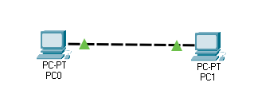
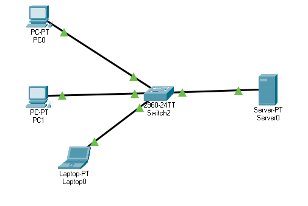

Introduction to network

# Introduction to Network 

## What is a network?

A network is just a digital telecommunication network that allows nodes to share resources.

---
## Building a network

### Point-to-point
|  |
|:--:|
| *A simple point-to-point connected computers Cisco's packet tracer* |

---
### client-server network

#### What is a client?

A device that access services provided by another device will act as the "server".

#### What is a server, then? 

A server is just a device that provides resources for other devices, the "client."

|  |
|:--:|
| *A simple client-server network using Cisco's packet tracer* |

---
## Differents type of network devices

- Switches
- Repeater
- Bridges 
- Routers
- Firewalls
- Servers
- Clients

### switches

It has many network interfaces/ports for the end hosts to connect to. Provide connectivity to hosts within the same Local Area Network (LAN). However, it does not provide a connection between LANs. It will need to establish a connection with the other LAN through the internet, with routers.

### Repeater

A repeater is a device that will retransmit a received message with more substantial power. This device is normally used to amplify a signal's strength that needs to travel to far distances—used in both wireless and wired data communication networks. 

### Bridges

Bridges are network devices that are used to connects multiple LANs to form a larger LAN. Using a bridge to connect multiple LANs, we can make them appear in a single network. 

The process of connecting them is called bridging, and this device works at layer 2, the Data-Link layer, which makes it also called layer-2 switches.

### Routers 

This device enables two or more LANs to communicate with each other. It sends the data from one LAN to another LAN through the internet. This device also has fewer interfaces compared to switches. Routers also have some basic security features to secure the network.

### Firewall

Although routers have some security features to protect the network from malicious actors, we need a device whose sole purpose is to protect the network from outside attacks. This is where the firewall will be playing its part in a network. Malicious actors are individuals or organizations that want to attack a network to steal sensitive information or damage an enterprise.
